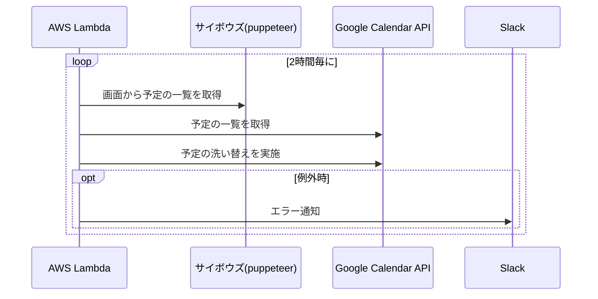

# cybozu2gcal

```mermaid
sequenceDiagram
  loop 2時間毎に
    participant L as AWS Lambda
    participant C as サイボウズ(puppeteer)
    participant G as Google Calendar API
    participant S as Slack

    L->>C: 画面から予定の一覧を取得
    L->>G: 予定の一覧を取得
    L->>G: 予定の洗い替えを実施
    opt 例外時
      L->>S: エラー通知
    end
  end
```
